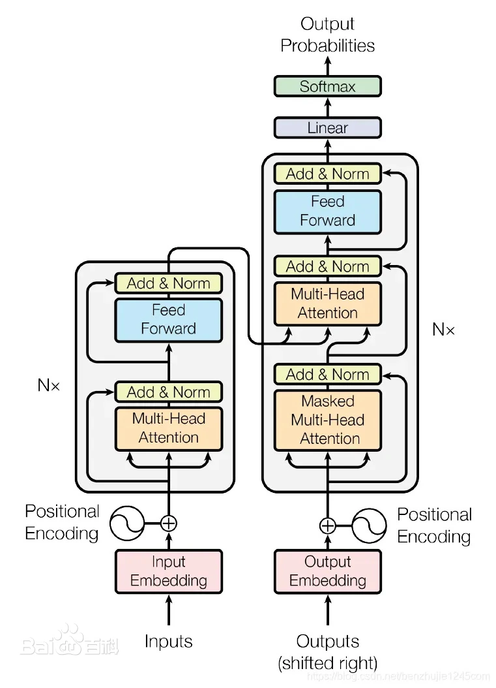

以下是一个README模板，可以在这个基础上修改

# Title (input here)
模型结构图


## Abstract
大概的工作改进

## Installation
### Requirements
项目使用的依赖 
Python版本、深度学习框架版本、一些刁钻的包、越详细越好，示例如下：

```
All the codes are tested in the following environment:
* Linux (tested on Ubuntu 18.04)
* NVIDIA RTX 3090 GPU
* CUDA 11.1 (recommended)
* pytorch 1.8+cu111 
* spconv+cu111
```

### Install
安装本项目，让使用者按照步骤一步一步可以安装上

下面是一个示例：
a. Clone the FGU3R repository.
```shell
git clone --recursive https://github.com/Raiden-cn/FGU3R
```

b. Install the main dependent python libraries like `pytorch`,[`spconv v2.x`](https://github.com/traveller59/spconv), `tensorboardX` etc.
please make sure you already install cuda 11.1 (only test on it)

```shell
pip install torch==1.8.1+cu111 torchvision==0.9.1+cu111 torchaudio==0.8.1 -f https://download.pytorch.org/whl/torch_stable.html
pip install spconv-cu111
pip install -r requirements.txt
```

c. Install this `fgu3r` library and its dependent libraries by running the following command:
```shell
cd FGU3R
python setup.py develop
```

## Dataset preparation
数据集的准备，把文件目录列出来，示例如下
```shell
FGU3R
├── data
│   ├── kitti
│   │   ├── ImageSets
│   │   ├── training
│   │   │   ├──calib
│   │   │   ├──velodyne
│   │   │   ├──label_2
│   │   │   ├──image_2
│   │   │   ├──pseudo_velodyne
│   │   │   ├──planes (optional)
│   │   ├── testing
│   │   │   ├──calib
│   │   │   ├──velodyne
│   │   │   ├──image_2
│   │   │   ├──pseudo_velodyne
├── fgu3r
├── tools
```
Execute the following command to generating `.pkl` and `gt_database` for training and testing:
```shell
cd FGU3R
python -m fgu3r.datasets.kitti.kitti_dataset create_kitti_infos tools/cfgs/dataset_configs/kitti_dataset.yaml
```
After this, the `.pkl` and `gt_database` will generated as following:
```shell
FGU3R
├── data
│   ├── kitti
│   │   ├── ImageSets
│   │   ├── gt_database
│   │   ├── gt_database_pseudo
│   │   ├── training
│   │   │   ├──calib
│   │   │   ├──velodyne
│   │   │   ├──label_2
│   │   │   ├──image_2
│   │   │   ├──pseudo_velodyne
│   │   │   ├──planes (optional)
│   │   ├── testing
│   │   │   ├──calib
│   │   │   ├──velodyne
│   │   │   ├──image_2
│   │   │   ├──pseudo_velodyne
│   │   ├── kitti_dbinfos_train.pkl
│   │   ├── kitti_infos_test.pkl
│   │   ├── kitti_infos_train.pkl
│   │   ├── kitti_infos_trainval.pkl
│   │   ├── kitti_infos_val.pkl
├── fgu3r
├── tools
```

## Results
目前实验的结果
### KITTI val car
|              Detector                   | GPU (train)| Easy | Mod. | Hard|
|---------------------------------------------|:----------:|:-------:|:-------:|:-------:|
| [FGU3R](./tools/cfgs/kitti_models/FGU3R.yaml) | ~13 GB | 95.26 | 85.84 | 83.67 | 
****

## Running
### Training
训练命令
```shell
cd tools
python train.py --cfg_file cfgs/kitti_models/fgu3r.yaml
```

### Testing
测试命令，可以得到上面得结果
```shell
cd tools
python test.py --cfg_file cfgs/kitti_models/fgu3r.yaml --ckpt ../ckpt/fgu3r.pth
```

### Others
其他功能的一些命令

## TODO
 - [ ] Release pseudo point cloud link


## 其他需要说明的